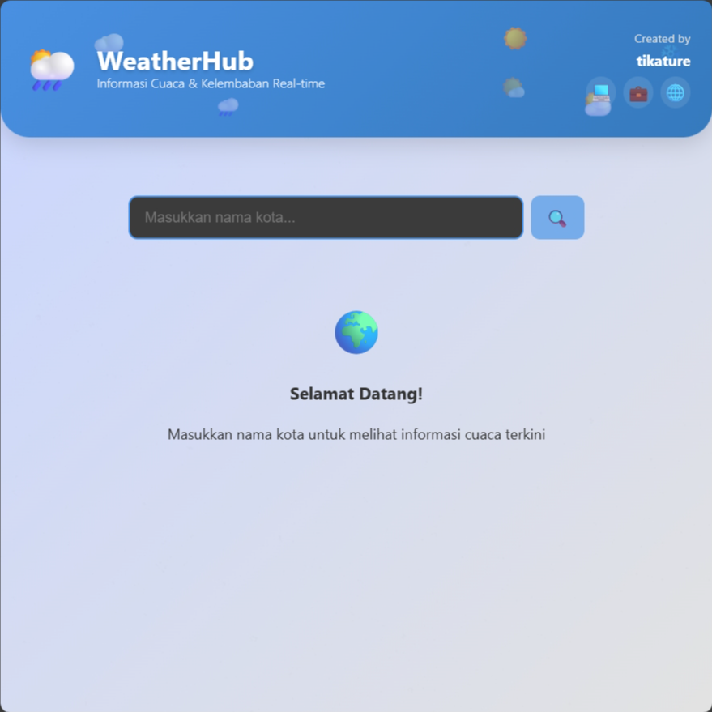

# 🌤️ WeatherHub

**WeatherHub** adalah aplikasi cuaca modern berbasis **Vue.js** yang menyajikan informasi cuaca real-time berdasarkan kota yang dimasukkan pengguna. Aplikasi ini dirancang dengan antarmuka yang bersih, responsif, serta dilengkapi animasi halus dan saran kegiatan berdasarkan kondisi cuaca.

---

## ✨ Fitur Utama

- 🔍 Cari cuaca berdasarkan nama kota
- 📍 Informasi lokasi & waktu lokal
- 🌡️ Data cuaca lengkap: suhu, kondisi, kelembaban, kecepatan angin, jarak pandang, tekanan udara, UV Index, dan lainnya
- 🎯 **Saran kegiatan otomatis** berdasarkan kondisi cuaca saat ini
- 💬 Transisi & animasi yang halus
- 📱 **Desain responsif** untuk perangkat desktop dan mobile

---

## 🚀 Teknologi yang Digunakan

- [Vue.js](https://vuejs.org/) (Composition API)
- [Axios](https://axios-http.com/) – HTTP client untuk permintaan API
- CSS3 – Transisi, animasi, dan media query
- Weather API (melalui backend proxy lokal `localhost:3001/weather`)

---
## 📸 Cuplikan Tampilan (Screenshots)

  
  

---

## 🤝 Kontribusi

Pull request dan issue sangat diterima!  
Silakan fork repo ini dan tambahkan fitur baru sesuai ide kamu.
